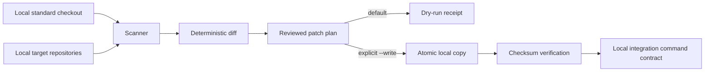

# Architecture of wellmanifest/sop

## Purpose and boundary

The repository owns a portable SOP contract and a deterministic **local** conformance runtime. It does not own a daemon, GitHub application, repair model, or validator service. Those capabilities remain in their runtime repositories. The guiding rule is: **autonomy modulates; automation generates**.

## SOP contract

Each canonical file in `spec/` is JSON-compatible YAML 1.2 and independently conforms to `schemas/sop.schema.json`. JSON syntax avoids a runtime YAML dependency while retaining YAML compatibility. `wellmanifest.sop/v1` requires:

- identity, semantic version, domain, philosophy, roles, and explicit preconditions;
- sequential numbered steps with action type, evidence, postconditions, and failure action;
- document-level postconditions;
- closed objects so misspelled fields fail validation.

`spec/sop-procedures.yaml` is the foundation-slice catalog. In ticket-001 only `sop-new-ticket.yaml` is normative. The repair, validator-dispatch, and cross-sync procedures are explicitly pending a dependent integration slice after ticket-001 is merged and closed.

## Runtime components

- `scanner.py` discovers only direct local Git repositories. Both `.git` directories and linked-worktree `.git` files are accepted. It compares regular managed files by SHA-256 and sorts repositories and paths.
- `engine.py` converts findings into immutable patch operations, reuses managed-path validation, rejects symlink source components, detects template changes after planning, preflights every batch operation, writes each file through a same-directory temporary file plus `os.replace`, and verifies final hashes.
- `validator.py` enforces the semantic v1 contract without third-party dependencies.
- `cli.py` exposes `scan`, `diff`, `patch`, `sync`, `verify`, and `validate-spec`. JSON output is stable and machine-readable.

## Safety and trust boundaries

The runtime never fetches URLs, calls GitHub, commits, pushes, opens pull requests, or merges. A standard must be a local path; strings containing `://` are rejected. Symlink sources and targets are rejected, writes cannot escape the resolved target repository, and `.git/**` is never a valid managed path.

`sync` is dry-run unless the operator supplies `--write`. Managed paths must be canonical relative POSIX paths and cannot contain `..`, `.git`, drive prefixes, backslashes, or redundant segments. A patch binds the source SHA-256 observed during planning; changing the source invalidates the plan. Before a write batch, every path, source type, and source hash is preflighted, so an invalid later operation cannot allow an earlier write. Each individual replacement is atomic. The batch is not a multi-file transaction: an I/O failure during the write phase can leave earlier files applied. The operator remains responsible for reviewing repository ownership and ticket bounds before `--write`.

## Hook, subactor, and validator integrations

`IntegrationContract` renders argument arrays but intentionally executes nothing:

1. cross-repository hook installation renders `scripts/install-agent-hosts.sh --source <standard> --target <repo>`; in-place activation may call the script without arguments;
2. repair dispatch points to an authorized `subactor.repair` boundary;
3. validator dispatch points to protected `dispatch-direct-pr.sh` after exact-head publication freeze.

Rendered commands are not authorization or approval evidence. Networked dispatch, organization-wide installation, PR review, merge, and real model evaluation remain external operations. This ticket does not perform them.

## Failure and rollback

Scanning and planning are read-only. Batch preflight rejects unsafe paths, symlinked source components, and stale hashes before any target write. A failed per-file atomic replacement reports failure and leaves no accepted batch receipt, but earlier files in the same batch may already have been replaced; there is no automatic multi-file rollback. Recovery is a newly reviewed plan from a known prior local standard checkout. The runtime never silently infers or executes rollback.

## Determinism and receipts

Reports omit wall-clock timestamps. Ordering uses normalized path/name keys, summaries are sorted, and content identity uses SHA-256. CLI JSON output is the receipt; callers may persist it in their authorized evidence location. External approval receipts must bind repository, PR, exact HEAD, ticket, and actor and cannot be authored by this runtime.
